#  FHIR-Native Geospatial Disease Outbreak Mapper
### *Empowering Community Health Workers with HL7 FHIR Interoperability & Real-Time Geospatial Epidemiology*           
  


---

##  The Challenge & The FHIR Solution           
In global health, **speed is everything**. When infectious outbreaks occur in remote areas, delayed case reporting leads to delayed containment—resulting in preventable loss of life. Most community-level reporting tools store epidemiological data in proprietary, isolated database formats. This creates data silos that cannot talk to local clinics, national electronic medical records (EMRs), or global health agencies (such as the WHO).   

Our project bridges this gap by being **fully native to the HL7 FHIR (Fast Healthcare Interoperability Resources) R4 standard**. Every suspected outbreak report submitted by a Community Health Worker (CHW) in the field is dynamically decomposed and mapped to standardized, interconnected clinical resources. This makes our data instantly compatible with global healthcare IT ecosystems.          


##  Key Features      

*  Secure, Role-Based Access Control      
   Restricted registration requiring verified CHW codes to guarantee epidemiological data integrity.  
* FHIR-Compliant Data Standardization
  Fully interoperable data models native to HL7 FHIR R4.
  Standardized clinical terminology mappings for diseases, symptoms, and severities.
*  Offline-First Resilience (Room + WorkManager)  
  * Fully operational in remote field areas with zero cellular connectivity.    
  * Automatic caching and network-aware background synchronization. 
*  Automated Geospatial Mapping
  * Automatic capture of high-accuracy GPS coordinates during report entry.
  * Real-time rendering of color-coded risk markers (Red for Severe/High Risk, Orange for Moderate/Medium Risk, Yellow for Mild/Low Risk) by querying FHIR Location bundles.
*  Analytics Dashboard
  * View pending sync counts, trends, and regional threat levels at a glance.        

---

##  App Screenshots    

<div align="center">
  <table>  
    <tr>
      <td align="center">  
        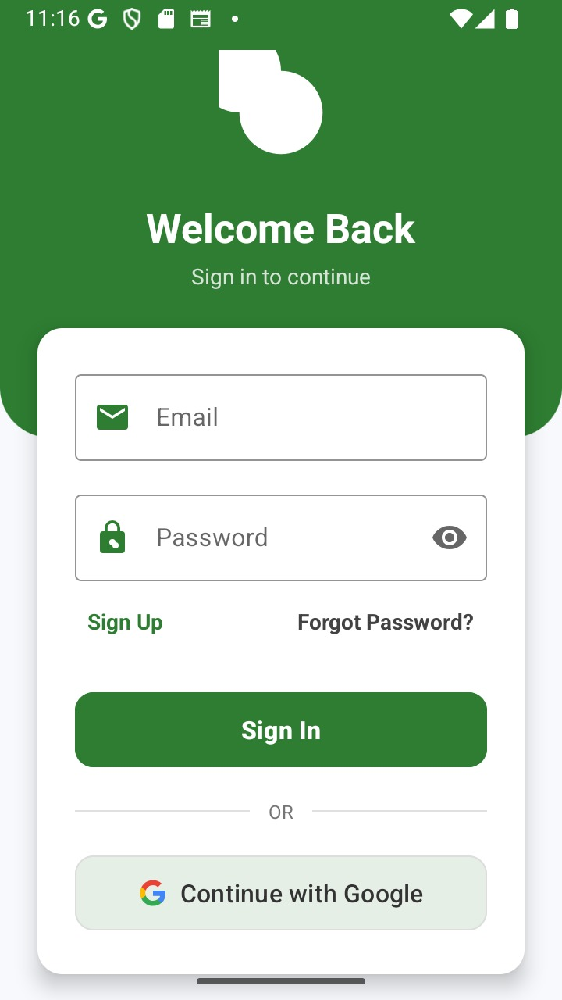<br/>  
        <b>Login Screen</b>
      </td>
      <td align="center">
        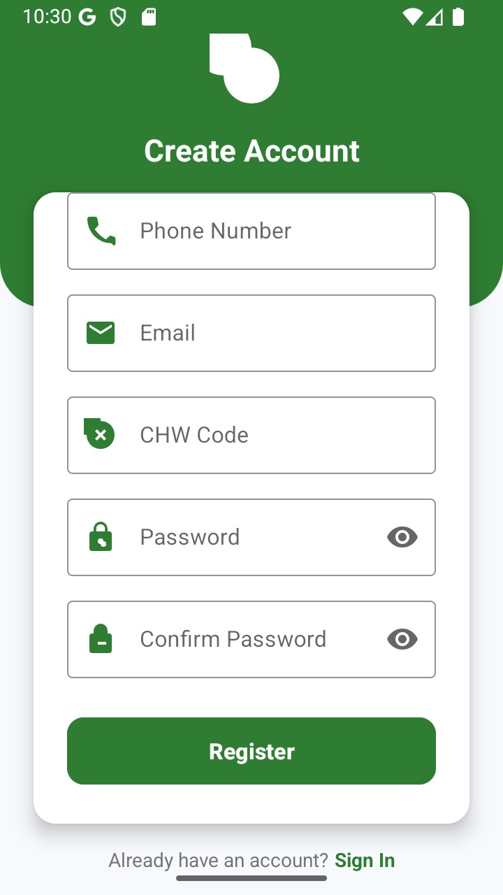<br/>
        <b>Registration Screen</b>
      </td>
      <td align="center">
        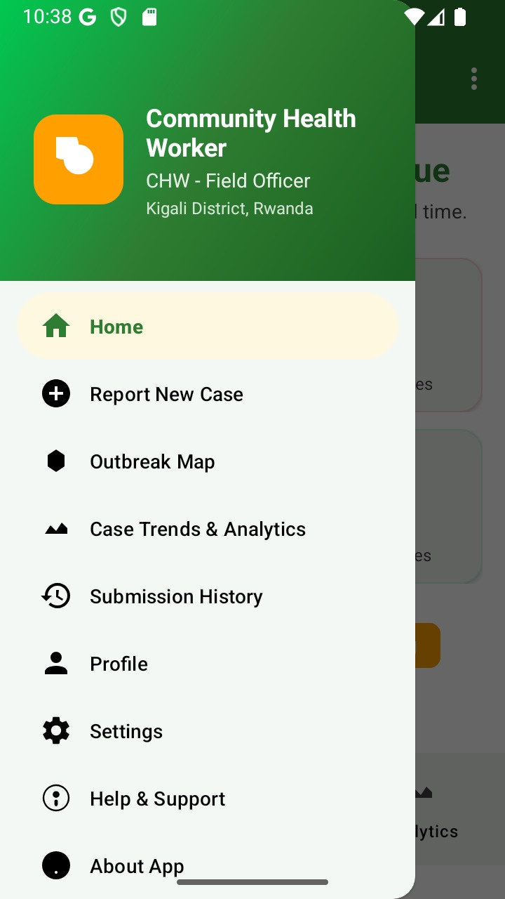<br/>
        <b>Home Dashboard</b>
      </td>
    </tr>
    <tr>
      <td align="center">
        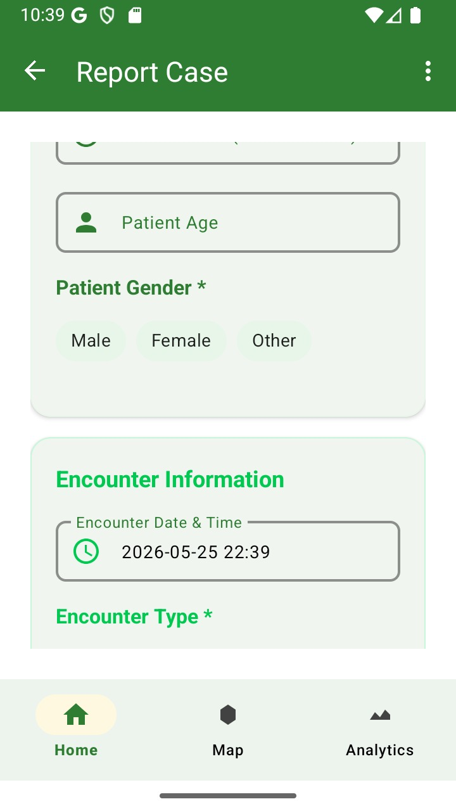<br/>
        <b>Report Form</b>
      </td>  
      <td align="center">
        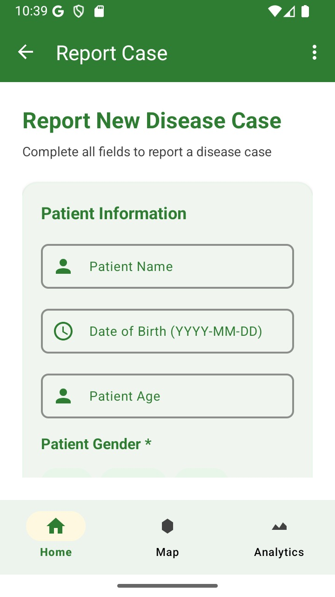<br/>
        <b>Case Details</b>
      </td>
      <td align="center">
        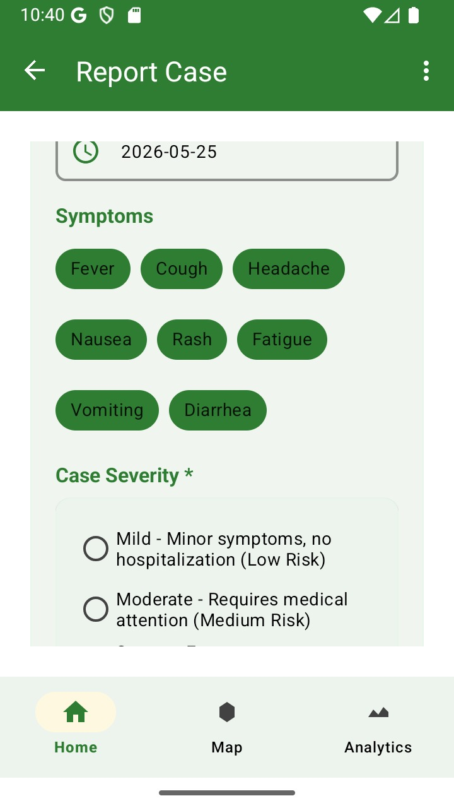<br/>
        <b>Complete Report</b>
      </td>
    </tr>
    <tr>
      <td align="center">
        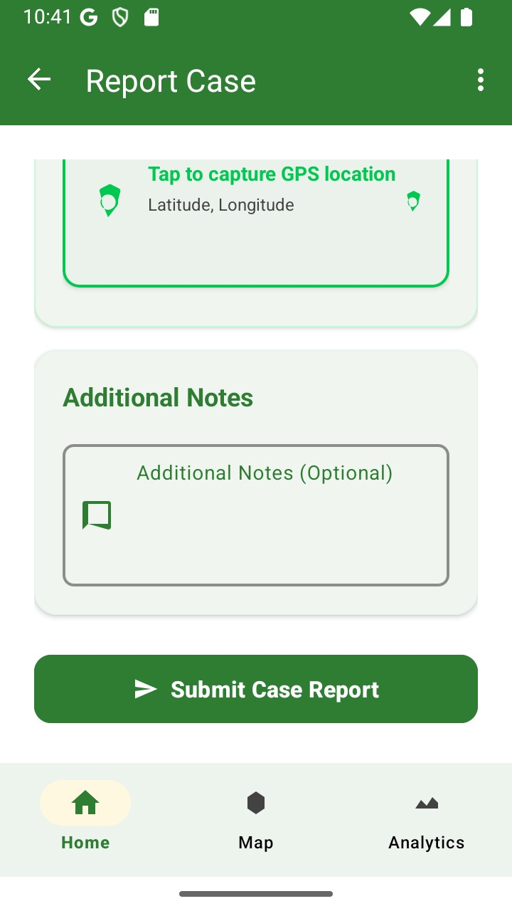<br/>
        <b>Submit Report</b>
      </td>
      <td align="center">
        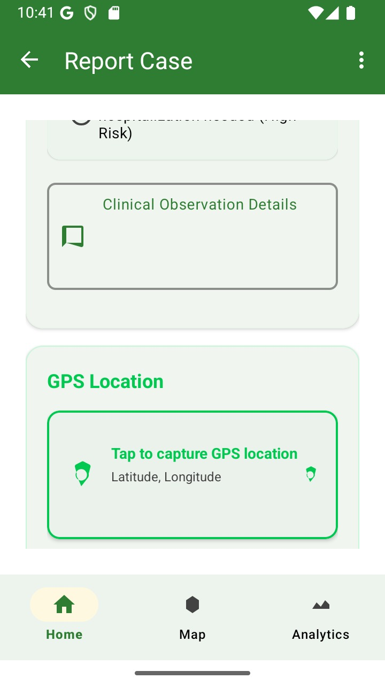<br/>
        <b>GPS Location</b>
      </td>
      <td align="center">
        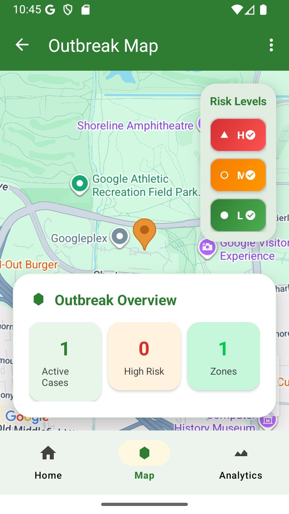<br/>
        <b>Outbreak Map</b>
      </td>
    </tr>
    <tr>
      <td align="center" colspan="3">
        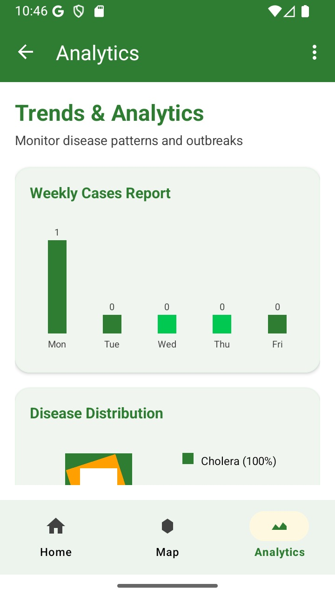<br/>
        <b>Analytics Dashboard</b>
      </td>
    </tr>
  </table>
</div>


##  Architectural Blueprint

The application employs a decoupled three-tier architecture designed for field-resilience and real-time dashboard visibility:

```
[ CHW Mobile Client ] ──(Room SQLite Cache)──> [ WorkManager Sync ]
                                                      │ (Retrofit HTTP POST)
                                                      ▼
[ MoH Web Dashboard ] <──(FHIR Bundles GET)─── [ Central FHIR Server ]
```

---

##  HL7 FHIR Interoperability & Data Modeling         

Every outbreak report filed by a CHW is modeled as a graph of **linked FHIR R4 Resources** rather than a single database row. This design enables plug-and-play interoperability with any standard FHIR server globally.

### 1. FHIR Resource Relationship Model    

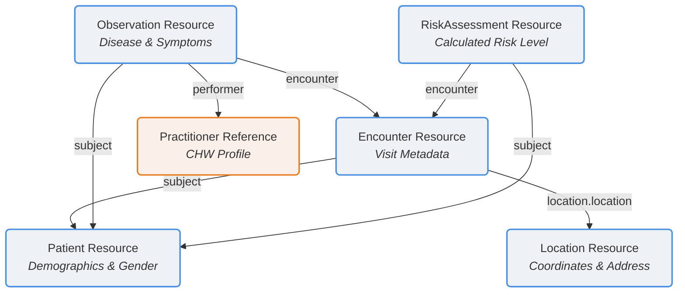

### 2. Deep-Dive: FHIR Resource Mappings & Code Structures  

####  Patient Resource
Contains standardized demographic details of the patient. Gender is normalized to lowercase per standard spec guidelines.
```json
{
  "resourceType": "Patient",
  "id": "patient-102a",
  "name": [
    {
      "use": "official",
      "text": "Jane Mukamana"
    }
  ],
  "gender": "female",
  "birthDate": "1994-06-12"
}
```

####  Location Resource
Stores coordinates and address metadata used for geospatial hotspot detection and mapping.
```json
{
  "resourceType": "Location",
  "id": "location-45b",
  "name": "Kigali Sector 4 Outbreak Point",
  "description": "GPS coordinates from CHW mobile client",
  "mode": "instance",
  "position": {
    "longitude": 30.0619,
    "latitude": -1.9441
  },
  "address": {
    "text": "Kigali, Gasabo District, Rwanda"
  }
}
```

####  Encounter Resource
Associates the patient and location, capturing the specific CHW home visit metadata.  
```json
{
  "resourceType": "Encounter",
  "id": "encounter-89c",
  "status": "finished",
  "class": {
    "system": "http://terminology.hl7.org/CodeSystem/v3-ActCode",
    "code": "HH",
    "display": "home health"
  },
  "subject": {
    "reference": "Patient/patient-102a"
  },
  "location": [
    {
      "location": {
        "reference": "Location/location-45b"
      }
    }
  ],
  "period": {
    "start": "2026-05-23T20:10:00Z",
    "end": "2026-05-23T20:25:00Z"
  }
}
```

####  Observation Resource 
The core clinical resource representing the suspected disease case, symptoms, severity, and the performing CHW.
```json
{
  "resourceType": "Observation",
  "id": "observation-12d",
  "status": "final",
  "code": {
    "coding": [
      {
        "system": "http://hl7.org/fhir/sid/icd-10",
        "code": "A00",
        "display": "Cholera"
      }
    ],
    "text": "Cholera"
  },
  "subject": {
    "reference": "Patient/patient-102a"
  },
  "encounter": {
    "reference": "Encounter/encounter-89c"
  },
  "effectiveDateTime": "2026-05-23T20:10:00Z",
  "performer": [
    {
      "reference": "Practitioner/CHW001",
      "display": "Louis Uwizeyimana"
    }
  ],
  "valueString": "Symptoms: Fever, Severe Diarrhea. Severity: Severe."
}
```

####  RiskAssessment Resource
Assesses risk levels calculated dynamically from severity markers to categorize outbreak clusters.
```json
{
  "resourceType": "RiskAssessment",
  "id": "risk-88e",
  "status": "final",
  "subject": {
    "reference": "Patient/patient-102a"
  },
  "encounter": {
    "reference": "Encounter/encounter-89c"
  },
  "prediction": [
    {
      "outcome": {
        "text": "High-risk Outbreak Cluster"
      },
      "qualitativeRisk": {
        "coding": [
          {
            "system": "http://terminology.hl7.org/CodeSystem/risk-probability",
            "code": "high",
            "display": "High Risk"
          }
        ]
      }
    ]
  ]
}
```

---

##  Offline-First Sync Engine

When cellular networks are spotty or non-existent in field locations, the application maintains complete reliability using the following sync sequence:

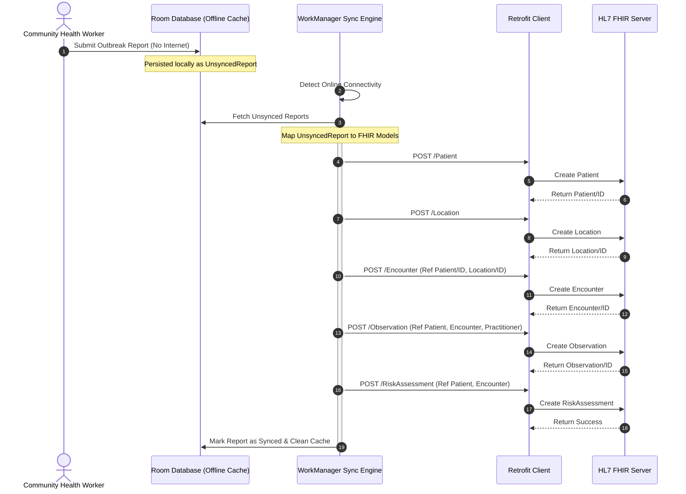

---

##  Tech Stack

* **Platform Architecture**: Native Android SDK (Java)
* **Local Persistence**: Room Database (SQLite engine with entity-relational caching schemas)
* **API Communication**: Retrofit 2 & OkHttp 3 HTTP clients
* **Background Processing**: Jetpack WorkManager for network-constrained auto-sync
* **Geospatial Mapping**: Google Play Services (Location & Maps API)

---

##  Developer Setup Guide 

###  Pre-requisites & Account Credentials
To verify epidemiological data integrity, the system rejects random account registrations. Developers must register test CHW accounts using one of the pre-configured CHW Codes:

> [!IMPORTANT]
> **Allowed CHW Registration Codes:**
> - `CHW001`
> - `CHW002`
> - `CHW003`
> - `CHW004`
> - `CHW005`
> 
> *Registrations containing any other code values will fail.*

###  Config API Keys
Before building the project locally, add your Google Maps API Credentials:
1. Open the [local.properties](file:///C:/Users/User/Desktop/projects/outbreak-app/local.properties) file in the root project folder. 
2. Inject your API key as follows:
   ```properties
   MAPS_API_KEY=AddYourActualGoogleMapsAPIKeyHere
   ```
3. Sync Gradle. The Gradle Kotlin DSL script reads this property and automatically injects it into your manifest placeholders on compilation.

---

##  System Usage Flow

1. **Secure Onboarding**: Authenticate or sign up with a valid `CHW Code`.
2. **Dashboard Overview**: Check pending reports requiring synchronization and monitor regional stats.
3. **Outbreak Reporting**: Complete patient case sheets. Select severity:
   * **Mild** (Low Risk)
   * **Moderate** (Medium Risk)
   * **Severe** (High Risk)
4. **GPS Auto-tag**: The device captures current latitude/longitude coordinates automatically.
5. **Submission & Queue**: Click submit. The app attempts live delivery, falling back to local SQLite cache if offline.
6. **Geospatial Map Verification**: Check updated outbreak points with color-coded severity heat pins.

---

**© 2025 Geospatial Disease Outbreak Mapper**  
*Interoperable health data for a safer tomorrow.*
